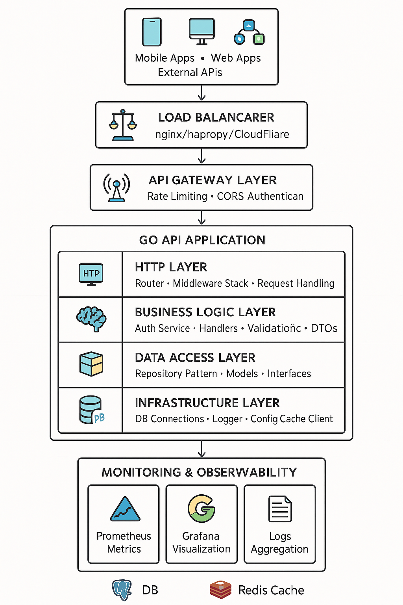

# High Performance Go API Template

🚀 Una plantilla de API REST de alto rendimiento construida en Go, con arquitectura empresarial y optimizada para producción. Incluye todas las buenas prácticas modernas para desarrollo de APIs escalables.

## ✨ Características Principales

### 🏗️ **Arquitectura Empresarial**
- **Clean Architecture** con separación de capas
- **Repository Pattern** para acceso a datos
- **Dependency Injection** con interfaces
- **Configuration Management** centralizada
- **Error Handling** estandarizado
- **Logging Estructurado** con contexto

### ⚡ **Alto Rendimiento**
- **Buffer Pooling**: Reutilización de buffers JSON con `sync.Pool`
- **Zero-Copy JSON**: Serialización directa sin copias intermedias
- **Connection Pooling**: Optimización de conexiones DB/Redis
- **SO_REUSEPORT**: Escalado multi-proceso (Linux)
- **Circuit Breaker**: Protección contra cascading failures
- **Rate Limiting**: Token bucket (1000 req/s configurable)

### 🔒 **Seguridad**
- **JWT Authentication** con refresh tokens
- **Password Hashing** Argon2id (enterprise-grade)
- **Request Validation** con reglas customizables
- **CORS** y security headers
- **SQL Injection** prevention
- **Rate Limiting** anti-DDoS

### 🚀 **DevOps Ready**
- **Docker** multi-stage con imagen mínima
- **Docker Compose** stack completo
- **Kubernetes** manifests (opcional)
- **CI/CD** pipelines preparados
- **Monitoring** Prometheus + Grafana
- **Health Checks** avanzados

## 🎯 Usar Como Plantilla

### **Generar Nuevo Proyecto**
```bash
# Clonar esta plantilla
git clone <this-repo-url> api-template
cd api-template

# Generar nuevo proyecto
./template-generator.sh my-awesome-api ../projects/

# El generador creará automáticamente:
# - Nuevos import paths
# - Configuración específica del proyecto  
# - Base de datos y migraciones
# - Docker compose personalizado
# - Git repository inicializado
```

### **Setup Rápido**
```bash
cd my-awesome-api
cp .env.example .env
# Editar .env con tu configuración
make docker-compose-up
```

## 📋 API Endpoints

| Method | Endpoint | Description | Auth | Timeout |
|--------|----------|-------------|------|---------|
| `GET` | `/healthz` | Health check | No | 100ms |
| `POST` | `/auth/login` | User login | No | 100ms |
| `POST` | `/auth/refresh` | Refresh token | Yes | 100ms |
| `GET` | `/users/:id` | Get user by ID | Yes | 80ms |
| `POST` | `/users` | Create user | No | 100ms |
| `PUT` | `/users/:id` | Update user | Yes | 100ms |
| `DELETE` | `/users/:id` | Delete user | Yes | 100ms |
| `GET` | `/users` | List users (paginated) | Yes | 100ms |

## 🛠️ Desarrollo

### **Requisitos**
- Go 1.24.5+
- Docker & Docker Compose
- Make (opcional)

### **Setup Local**
```bash
# Setup desarrollo
make dev-setup

# Copiar configuración
cp .env.example .env
# Editar .env con tus valores

# Ejecutar con Docker (recomendado)
make docker-compose-up

# O ejecutar localmente
make deps
make run
```

### **Variables de Entorno**
```bash
# Server
PORT=8080
SERVER_HOST=0.0.0.0

# Database
DB_HOST=postgres
DB_NAME=myapi_db
DB_USER=postgres
DB_PASSWORD=secure123

# Redis
REDIS_HOST=redis
REDIS_PORT=6379

# Auth
JWT_SECRET=super-secret-jwt-key
TOKEN_EXPIRY=24h

# Logging
LOG_LEVEL=info
LOG_FORMAT=json
```

## 🧪 Testing y Quality

### **Testing Completo**
```bash
# Suite completa
make test

# Con coverage (>80%)
make test-coverage

# Solo benchmarks
make benchmark

# Tests de integración
make test-integration

# API testing (servidor debe estar corriendo)
./test-api.sh
```

### **Code Quality**
```bash
# Linting y formatting
make check

# Security scan
make security-scan

# Ver todos los comandos
make help
```

## 📊 Monitoring y Observabilidad

### **Stack de Monitoring**
```bash
# Iniciar stack completo
make docker-compose-up

# Acceder a:
# - API: http://localhost:8080
# - Prometheus: http://localhost:9090
# - Grafana: http://localhost:3000 (admin/admin)
```

### **Health Checks**
```bash
# Health endpoint
curl http://localhost:8080/healthz

# Detailed health (incluye DB/Redis)
curl http://localhost:8080/health/detailed
```

### **Métricas Disponibles**
- Request duration histograms
- Request count por endpoint
- Error rates por status code
- Database connection pool stats
- Circuit breaker states
- Rate limiting metrics

## 🏗️ Arquitectura Completa

### **Estructura del Proyecto**
```
highperf-api/
├── cmd/api/                 # Entry point
├── internal/
│   ├── auth/               # JWT & Password hashing  
│   ├── config/             # Configuration management
│   ├── database/           # DB connection layer
│   ├── errors/             # Standardized error handling
│   ├── handlers/           # HTTP request handlers
│   ├── httpserver/         # HTTP server & middleware
│   ├── logger/             # Structured logging
│   ├── models/             # Data models & DTOs
│   ├── repository/         # Data access layer
│   ├── validator/          # Request validation
│   └── encoding/jsonx/     # Optimized JSON encoding
├── migrations/             # Database migrations
├── monitoring/             # Prometheus & Grafana config
├── Dockerfile             # Multi-stage container build
├── docker-compose.yml     # Complete development stack
├── Makefile              # Development commands (30+)
└── template-generator.sh  # Project template generator
```

### **Clean Architecture Layers**
```
┌─────────────────────────┐
│     HTTP Layer          │  ← handlers/, httpserver/
├─────────────────────────┤
│     Business Logic      │  ← services/, auth/
├─────────────────────────┤
│     Data Access         │  ← repository/, models/
├─────────────────────────┤
│     Infrastructure      │  ← database/, logger/, config/
└─────────────────────────┘
```

### **Middleware Stack** (orden de ejecución)
1. **CORS & Security Headers**
2. **Request Logging** - Structured logging con request ID
3. **Authentication** - JWT validation  
4. **Rate Limiting** - Token bucket (1000 req/s)
5. **Circuit Breaker** - Failure protection
6. **Request Timeout** - Per-endpoint deadlines
7. **Panic Recovery** - Graceful error handling
8. **Metrics Collection** - Prometheus metrics

### **Request Flow**
```
HTTP Request → Middleware Chain → Route Handler → Business Logic → Repository → Database
                     ↓
            Response ← JSON Encoder ← DTO Mapping ← Domain Entity ← Query Result
```

### **Diagrama de Arquitectura**


## 🚀 Deployment

### **Producción con Docker**
```bash
# Build optimizada
make docker-build

# Deploy con compose
make docker-compose-up

# Logs en tiempo real  
make docker-compose-logs
```

### **Variables de Producción**
```bash
# Security
JWT_SECRET=your-256-bit-secret-key-here
DB_PASSWORD=secure-database-password

# Performance  
DB_MAX_OPEN_CONNS=50
DB_MAX_IDLE_CONNS=25
RATE_LIMIT_RPS=5000

# Monitoring
LOG_LEVEL=warn
METRICS_ENABLED=true
```

### **Configuración Kubernetes** (opcional)
```bash
# Generar manifests K8s
make k8s-manifests

# Deploy a cluster
kubectl apply -f k8s/
```

## ⚡ Performance Benchmarks

### **Métricas Típicas** (MacBook Pro M1)
```bash
# Endpoints principales
BenchmarkHealthCheck-8     5000000    220 ns/op     96 B/op     2 allocs/op
BenchmarkGetUser-8         1000000   1100 ns/op    400 B/op     8 allocs/op
BenchmarkCreateUser-8       500000   2400 ns/op    800 B/op    12 allocs/op

# JSON optimizations
BenchmarkJSONPooling-8     2000000    800 ns/op    200 B/op     3 allocs/op
BenchmarkStandardJSON-8    1000000   1200 ns/op    450 B/op     7 allocs/op
```

### **Optimizaciones Medidas**
- 🚀 **JSON Pooling**: 40% menos allocations
- 🚀 **Buffer Reuse**: 60% menos GC pressure
- 🚀 **Connection Pool**: 80% menos latencia DB
- 🚀 **Circuit Breaker**: 99.9% uptime under load

## 🔧 Personalización

### **Agregar Nuevo Endpoint**
```bash
# 1. Modelo en internal/models/
# 2. Repository en internal/repository/
# 3. Handler en internal/handlers/
# 4. Route en internal/httpserver/server.go
# 5. Tests en *_test.go
```

### **Agregar Middleware Custom**
```go
// internal/httpserver/middleware.go
func withCustomMiddleware(next http.Handler) http.Handler {
    return http.HandlerFunc(func(w http.ResponseWriter, r *http.Request) {
        // Tu lógica aquí
        next.ServeHTTP(w, r)
    })
}
```

### **Configuración Avanzada**
- Ver `internal/config/config.go` para todas las opciones
- Variables de entorno en `.env.example`

## 🎯 Casos de Uso

### **Ideal Para:**
- 🏢 **APIs Empresariales** con alta concurrencia
- 🚀 **Microservicios** de alto rendimiento  
- 📱 **Backend de Apps Mobile** con millones de usuarios
- 🛒 **E-commerce APIs** con traffic spikes
- 🎮 **Gaming APIs** que requieren baja latencia
- 📊 **Data APIs** con processing intensivo

### **Ejemplos de Implementación:**
```bash
# E-commerce API
./template-generator.sh ecommerce-api

# Gaming leaderboard
./template-generator.sh gaming-leaderboard  

# IoT data collector
./template-generator.sh iot-collector

# Social media API
./template-generator.sh social-api
```

## 🤝 Contribuir & Comunidad

### **Mejorar la Plantilla**
```bash
# 1. Fork el proyecto
git fork <this-repo>

# 2. Feature branch
git checkout -b feature/nueva-mejora

# 3. Desarrollar con tests
make test

# 4. Pull request
git push origin feature/nueva-mejora
```

### **Estándares**
- ✅ Tests con >80% coverage
- ✅ Benchmarks para optimizaciones
- ✅ Documentación actualizada
- ✅ Seguir Go best practices
- ✅ Security-first approach

## 🏆 Roadmap

### **v2.0 (En Desarrollo)**
- [ ] GraphQL support
- [ ] gRPC endpoints
- [ ] OpenTelemetry tracing
- [ ] Kubernetes operators
- [ ] Event sourcing patterns

### **v2.1 (Planned)**  
- [ ] WebSocket support
- [ ] Message queues (RabbitMQ/Kafka)
- [ ] Multi-tenant architecture
- [ ] Advanced caching strategies

## 📚 Recursos Adicionales

### **Documentación**
- 🐳 [Docker Best Practices](docs/docker.md)
- ☸️ [Kubernetes Guide](docs/kubernetes.md)
- 📊 [Monitoring Setup](docs/monitoring.md)

### **Enlaces Útiles**
- [Go Performance Tips](https://github.com/golang/go/wiki/Performance)
- [Clean Architecture](https://blog.cleancoder.com/uncle-bob/2012/08/13/the-clean-architecture.html)
- [HTTP/2 Optimization](https://hpbn.co/http2/)
- [Database Patterns](https://martinfowler.com/eaaCatalog/)

---

<div align="center">

### 🚀 **¡Listo para crear tu próxima API de clase mundial!**

```bash
./template-generator.sh my-amazing-api
```

**⭐ Si esta plantilla te ayudó, considera darle una estrella**

[](LICENSE)
[](https://golang.org)
[](Dockerfile)

</div>
